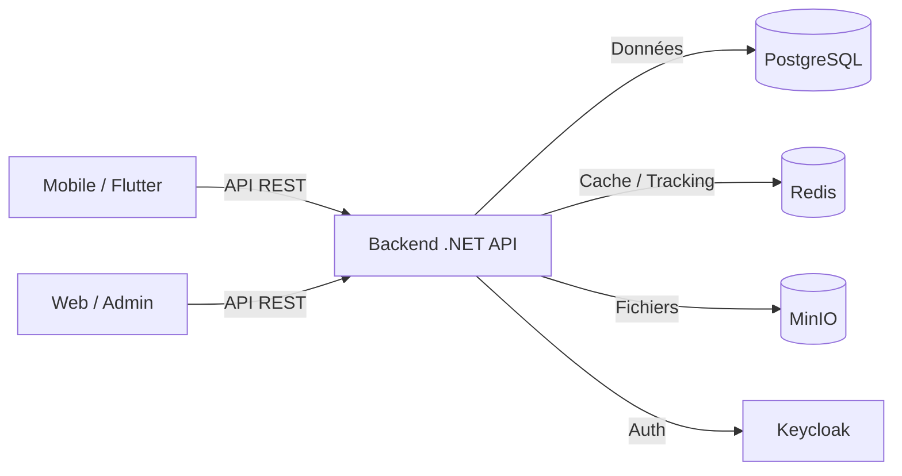
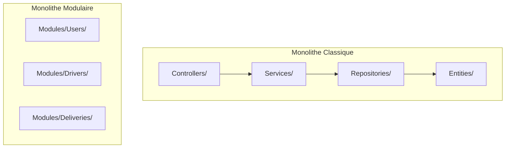
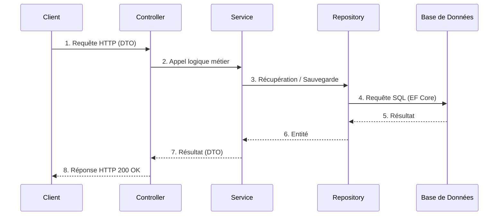
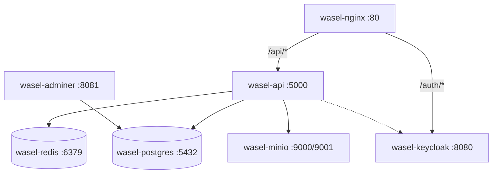
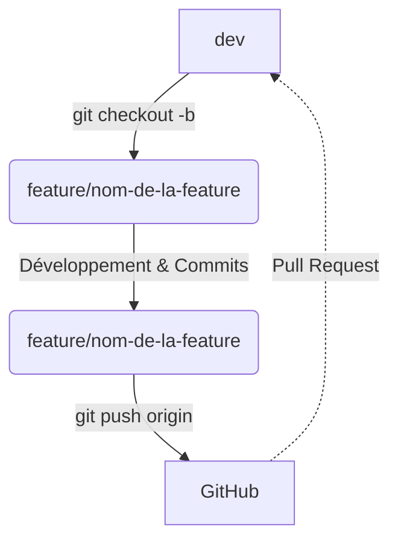
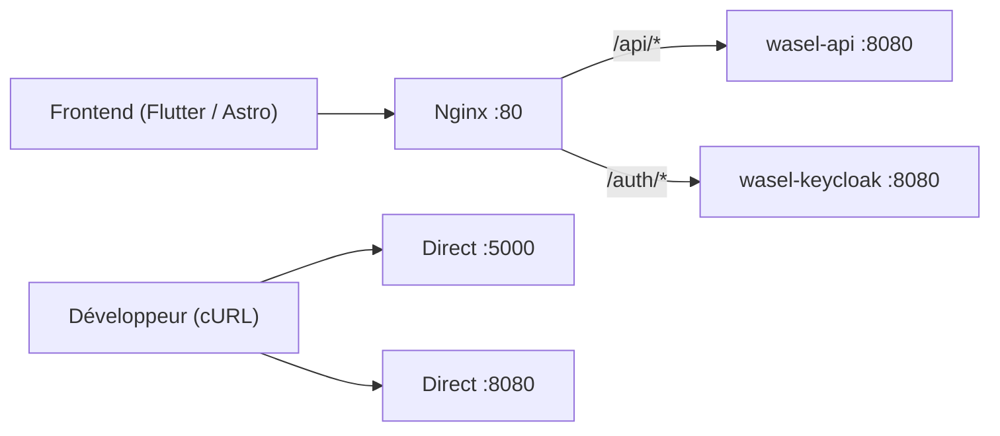

# Guide Backend Wassel — Architecture, Infrastructure et Règles de Développement

---

## 1. Objectif du document

Ce document sert de **référence centrale pour l'équipe backend**. 
Il a été conçu pour permettre à tout développeur, même nouvellement arrivé, de :
- Comprendre les choix architecturaux et la structure du projet.
- Démarrer rapidement l'environnement de développement local.
- Développer de nouvelles fonctionnalités sans casser l'architecture existante.
- Maintenir un code propre, professionnel et facile à faire évoluer en équipe.

---

## 2. Vue globale du projet Wassel

**Wassel** est une plateforme de livraison à la demande connectant des clients, des livreurs et des administrateurs.
Le backend joue le rôle d'API centrale (cerveau) qui orchestre les requêtes provenant des différentes applications clientes.



---

## 3. Ce qui a été mis en place dans cette branche

La branche actuelle (`setup/backend-architecture`) a mis en place les fondations solides du backend :

- **Projet .NET 10** (`backend/Wasel.Api`) structuré en **monolithe modulaire**.
- **Création des modules** vides prêts à être développés (`Auth`, `Users`, `Drivers`, `Deliveries`, `Payments`, `Documents`, `Tracking`, `Reviews`).
- **Dossiers `Shared` et `Infrastructure`** pour mutualiser le code technique et interagir avec l'extérieur.
- **Docker Compose** complet (`docker-compose.yml`) avec les services :
  - `wasel-api` (API backend)
  - `wasel-postgres` (PostgreSQL 18.3)
  - `wasel-redis` (Redis 8.6)
  - `wasel-minio` (Stockage d'objets)
  - `wasel-keycloak` (Gestion des identités IAM)
  - `wasel-adminer` (Interface graphique de BDD)
  - `wasel-nginx` (Reverse Proxy — point d'entrée unique)
- **API Documentation** moderne via `Scalar` intégrée nativement à l'OpenAPI de .NET 10.
- **Endpoint de santé** (`/api/health`) pour le monitoring.
- **Entités EF Core minimales** (`User`, `Driver`, `Delivery`) avec `BaseEntity` (gestion des timestamps d'audit).
- **Migration EF Core initiale** générée et qui s'applique *automatiquement* au démarrage en environnement de développement.
- **Fichiers de configuration propres** (`.env.example`, `appsettings.json`) dénués de secrets critiques.

> **Note sur l'Authentification :** Keycloak est déployé et fonctionnel dans Docker, mais le code de l'intégration JWT complète dans le backend fera l'objet d'une tâche de développement séparée (Module `Auth`).

---

## 4. Pourquoi on a choisi un monolithe modulaire

Pour commencer un projet de l'envergure de Wassel, nous avons opté pour le **Monolithe Modulaire** plutôt qu'un monolithe classique ou une architecture microservices d'emblée.

- **Un seul backend .NET** : Une seule application à lancer et déployer, facilitant grandement la vie des développeurs et le déploiement initial.
- **Code isolé par métier (Modules)** : Le code n'est pas rangé par son *type technique* mais par sa *signification métier*.
- **Évolution facilitée** : Si le module `Deliveries` ou `Tracking` devient énorme dans 1 an, il sera très facile de l'extraire en un véritable microservice car il est déjà isolé.

**Comparaison rapide :**



---

## 5. Architecture actuelle du backend

Voici l'arborescence réelle du projet .NET dans `backend/Wasel.Api/` :

```text
backend/Wasel.Api/
├── Infrastructure/      <-- Intégrations externes
│   ├── Email/
│   ├── Keycloak/
│   ├── Maps/
│   ├── MinIO/
│   └── Redis/
├── Migrations/          <-- Historique des schémas EF Core
├── Modules/             <-- Cœur du métier (Chaque dossier est indépendant)
│   ├── Auth/
│   ├── Deliveries/
│   ├── Documents/
│   ├── Drivers/
│   ├── Payments/
│   ├── Reviews/
│   ├── Tracking/
│   └── Users/
├── Shared/              <-- Éléments communs transversaux
│   ├── Common/          (ex: BaseEntity)
│   ├── Database/        (ex: WaselDbContext)
│   ├── Exceptions/      (ex: ApiException)
│   ├── Responses/       (ex: ApiResponse)
│   └── Security/
├── Dockerfile
├── Program.cs
├── appsettings.json
├── appsettings.Development.json
└── Wasel.Api.csproj
```

---

## 6. Rôle de chaque dossier principal

### `Modules/`
Contient les "domaines" métier de Wassel. L'intérieur d'un module rassemble absolument **tout le code nécessaire à cette fonctionnalité** (contrôleurs, entités, accès aux données, règles métier).

### `Shared/`
Contient les utilitaires et la fondation technique partagés entre tous les modules pour éviter la duplication.
- `BaseEntity` (Gestion automatique des ID, CreatedAt, UpdatedAt).
- `WaselDbContext` (L'orchestrateur de la base de données).
- Exceptions et formats de réponse d'API standardisés.

### `Infrastructure/`
Contient les adaptateurs pour communiquer avec le monde extérieur.
Le code métier (`Modules/`) ne doit jamais parler directement à une API externe. Il passe par une interface dont l'implémentation se trouve dans `Infrastructure/` (ex: `KeycloakAuthService`, `MinIoStorageService`).

---

## 7. Structure interne d'un module

Lorsqu'un développeur travaille sur une feature, il reste la majorité du temps au sein du même dossier de module. 

Prenons l'exemple du module `Deliveries` :

```text
Modules/Deliveries/
├── Controllers/     <-- Endpoints HTTP de l'API (ex: DeliveriesController.cs)
├── DTOs/            <-- Objets de transfert de données (Requêtes/Réponses)
├── Entities/        <-- Les classes reflétant les tables de base de données (ex: Delivery.cs)
├── Enums/           <-- Les énumérations métier (ex: DeliveryStatus.cs)
├── Services/        <-- La vraie logique métier de l'application
├── Repositories/    <-- Les requêtes complexes à la base de données (EF Core)
└── Configurations/  <-- Le mapping spécifique EF Core pour les entités de ce module
```

**Flux d'une requête type :**


---

## 8. Règles de développement backend

**Le non-respect de ces règles peut justifier un rejet lors d'une Pull Request.**

### Règle 1 — Ne pas mélanger les modules
Tout ce qui concerne l'utilisateur reste dans `Modules/Users`. Si le module `Deliveries` a besoin d'informations d'un utilisateur, il appelle un service interface du module `Users`, il ne tape pas directement dans la table `Users` depuis son repository.

### Règle 2 — Le controller est "stupide" (Pas de logique métier)
Un controller reçoit la requête HTTP, valide le format, appelle un Service métier, et retourne le résultat. Il **ne fait aucun calcul** métier ou vérification complexe.

### Règle 3 — Ne pas retourner directement les entités EF Core
Ne renvoyez jamais une classe du dossier `Entities/` directement dans un contrôleur. Créez un DTO (Data Transfer Object) spécifique (ex: `DeliveryResponseDto`) dans `DTOs/` pour éviter d'exposer des données sensibles ou des références cycliques JSON.

### Règle 4 — Les services contiennent la logique métier
C'est ici qu'on code : calcul de la distance, validation si un livreur a le droit de prendre une course, changements de `DeliveryStatus`.

### Règle 5 — Les repositories gèrent l'accès aux données
Ne faites pas de grosses requêtes `_dbContext.Deliveries.Where(...).Include(...)` dans le Controller ou le Service. Confiez cette extraction au Repository (`IDeliveryRepository`).

### Règle 6 — Les services externes passent par `Infrastructure/`
Le module `Documents` ne doit pas contenir la logique de connexion à MinIO. Le module appelle une interface `IStorageService`, qui est implémentée physiquement dans `Infrastructure/MinIO/`.

### Règle 7 — Pas de secrets dans le code
Il ne doit y avoir **aucun mot de passe ni clé d'API** dans le code C# ni dans `appsettings.json`. Utilisez le fichier `.env` localement ou les variables d'environnement sur le serveur.

### Règle 8 — Le code doit compiler avant chaque push
Exécutez toujours un `dotnet build` local avant de *commiter*.

---

## 9. Comment lancer le projet localement

1. **Cloner le repository** et ouvrir un terminal à la racine.
2. **Configurer l'environnement local** :
   ```bash
   # Linux/macOS ou Git Bash
   cp .env.example .env
   ```
   *(Modifiez les valeurs du fichier `.env` si besoin, mais les valeurs par défaut suffisent pour le dev).*
3. **Lancer l'infrastructure (Docker Compose)** :
   ```bash
   docker compose up -d --build
   ```
4. **Vérifier que tout tourne** :
   ```bash
   docker compose ps
   # Vous devez voir 7 services "Up" et les bases de données "healthy".
   ```
5. **Tester l'API** :
   ```bash
   # Accès direct
   curl http://localhost:5000/api/health
   # Accès via Nginx
   curl http://localhost/api/health
   ```

**URLs de développement local :**

| Service | Accès Direct | Accès via Nginx |
|---|---|---|
| 📖 **API (Scalar)** | `http://localhost:5000/scalar/v1` | `http://localhost/scalar/v1` |
| 🔑 **Keycloak (Auth)** | `http://localhost:8080/auth` | `http://localhost/auth/` |
| 💾 **Adminer (BDD)** | `http://localhost:8081` | — |
| 🗂️ **MinIO (Fichiers)** | `http://localhost:9001` | — |

**Adminer :**
  - Système : `PostgreSQL`
  - Serveur : `wasel-postgres`
  - Utilisateur : `wasel_user`
  - Mot de passe : *(valeur depuis .env.example)*
  - Base : `wasel_db`

---

## 10. Services Docker utilisés

| Service | Rôle | Accès Direct | Accès via Nginx |
|---|---|---|---|
| `wasel-nginx` | Reverse Proxy (point d'entrée) | — | `http://localhost` |
| `wasel-api` | API backend .NET | `http://localhost:5000` | `http://localhost/api/...` |
| `wasel-postgres` | Base de données relationnelle | `localhost:5432` | — |
| `wasel-redis` | Cache rapide / Tracking futur | `localhost:6379` | — |
| `wasel-minio` | Stockage d'objets compatibles S3 | Console : `http://localhost:9001`<br>API : `localhost:9000` | — |
| `wasel-keycloak`| Authentification IAM | `http://localhost:8080/auth` | `http://localhost/auth/...` |
| `wasel-adminer` | Interface UI de Base de données | `http://localhost:8081` | — |



---

## 11. Documentation API avec Scalar

Le projet utilise **Microsoft.AspNetCore.OpenApi** pour la génération OpenAPI native de .NET et **Scalar.AspNetCore** comme interface moderne de documentation. Ce choix remplace Swashbuckle dans notre configuration .NET 10 afin d'éviter les problèmes de compatibilité rencontrés.

- L'interface Scalar (`/scalar/v1`) offre une expérience utilisateur moderne et un testeur de requêtes plus avancé (intégrant la génération automatique de code client pour le frontend).
- Le fichier OpenAPI de définition brute se trouve sur `http://localhost:5000/openapi/v1.json`.

---

## 12. Base de données et EF Core

- L'orchestrateur principal est `WaselDbContext` (situé dans `Shared/Database/`).
- En environnement de développement local (`ASPNETCORE_ENVIRONMENT=Development`), **les migrations EF Core s'appliquent automatiquement au lancement de l'API Docker**. Vous n'avez pas besoin de lancer les updates manuellement.
- *Attention : En production, les migrations automatiques sont désactivées pour des raisons de sécurité.*

**Commandes utiles pour ajouter de nouvelles tables (depuis le host) :**
```bash
cd backend/Wasel.Api
dotnet ef migrations add "NomDeLaMigrationExplicite"
```
*Note : Ne générez des migrations que lorsque c'est justifié et donnez-leur des noms clairs (ex: `AddDriverVehicleTable`).*

**Règles de travail en équipe sur les migrations EF Core :**
1. Toujours faire un `git pull origin dev` avant de créer une migration pour s'assurer d'avoir la dernière version du schéma.
2. Une migration doit correspondre à un changement clair du modèle.
3. Évitez que plusieurs développeurs créent des migrations concurrentes pour le même module. Coordonnez-vous.

---

## 13. Focus sur l'Infrastructure externe

### Keycloak
Keycloak tourne dans Docker mais n'est pas encore lié au code .NET. La prochaine grande tâche sera :
- Créer le *Realm* Wassel.
- Implémenter l'authentification et l'autorisation (Rôles `CLIENT`, `DRIVER`, `ADMIN`) via des Jetons JWT dans le backend.

### Redis
Présent pour le futur. Utilisé pour cacher des données fréquentes ou gérer des flux très rapides (comme la transmission instantanée de la géolocalisation d'un livreur via WebSockets). Ne tapez pas dans Redis depuis les Controllers.

### MinIO
Utilisé pour sauvegarder des fichiers physiques (Permis de conduire, photos de profil, preuves de livraison). La base de données PostgreSQL ne stockera que l'**URL** ou le chemin d'accès vers MinIO, jamais le fichier physique. L'image de dev local est volontairement figée sur une version Release stable.

### Module Files / URLs presignees MinIO

Le module `Files` expose uniquement des endpoints de generation d'URLs presignees. Le backend ne recoit jamais le contenu binaire du fichier : le client demande une URL temporaire, puis uploade directement le fichier vers MinIO avec cette URL. PostgreSQL ne stocke pas le fichier; les modules metier conservent seulement l'`objectKey` quand ils doivent rattacher un fichier a une ressource.

Configuration:
- Section `MinIO` dans `appsettings.json` / `appsettings.Development.json`.
- Variables Docker Compose: `MinIO__Endpoint`, `MinIO__AccessKey`, `MinIO__SecretKey`, `MinIO__BucketName`, `MinIO__UseSSL`.
- Bucket par defaut: `wasel-files`.

Endpoints ajoutes:

```http
POST /api/files/upload-url
Authorization: Bearer <TOKEN>
Content-Type: application/json
```

```json
{
  "fileName": "permis.pdf",
  "fileType": "pdf",
  "context": "DOCUMENT"
}
```

Reponse:

```json
{
  "uploadUrl": "https://...",
  "objectKey": "documents/<userId>/<guid>.pdf",
  "expiresInSeconds": 600
}
```

`fileType` autorises: `jpg`, `jpeg`, `png`, `pdf`.
`context` autorises: `PROFILE_PHOTO`, `DOCUMENT`, `DELIVERY_PROOF`, `COMPLAINT_EVIDENCE`.

Formats d'object keys:
- `profile-photos/{userId}/{guid}.{extension}`
- `documents/{userId}/{guid}.{extension}`
- `delivery-proofs/{userId}/{guid}.{extension}`
- `complaint-evidence/{userId}/{guid}.{extension}`

```http
GET /api/files/view-url?objectKey=<OBJECT_KEY>
Authorization: Bearer <TOKEN>
```

Reponse:

```json
{
  "viewUrl": "https://...",
  "expiresInSeconds": 300
}
```

Regles d'acces de cette premiere version:
- un utilisateur peut consulter un fichier si l'`objectKey` contient son `userId`;
- un `ADMIN` peut consulter tous les fichiers;
- sinon l'API retourne `403`.

Exemples cURL:

```bash
TOKEN="VOTRE_TOKEN_ICI"

curl -X POST "http://localhost:5000/api/files/upload-url" \
  -H "Authorization: Bearer $TOKEN" \
  -H "Content-Type: application/json" \
  -d '{"fileName":"permis.pdf","fileType":"pdf","context":"DOCUMENT"}'
```

```bash
curl -X POST "http://localhost:5000/api/files/upload-url" \
  -H "Authorization: Bearer $TOKEN" \
  -H "Content-Type: application/json" \
  -d '{"fileName":"script.exe","fileType":"exe","context":"DOCUMENT"}'
```

```bash
curl -X GET "http://localhost:5000/api/files/view-url?objectKey=documents/<userId>/<guid>.pdf" \
  -H "Authorization: Bearer $TOKEN"
```

Upload direct vers MinIO apres generation de l'URL:

```bash
curl -X PUT "$UPLOAD_URL" \
  -H "Content-Type: application/pdf" \
  --upload-file ./permis.pdf
```

### Architecture MinIO: InternalEndpoint vs PublicEndpoint

Pour que les URLs présignées générées par le backend soient utilisables par le frontend tout en préservant la validité des signatures S3 AWS, la configuration MinIO utilise deux endpoints distincts :

1. **`InternalEndpoint`** (ex: `wasel-minio:9000`) : Utilisé par le backend pour communiquer avec MinIO de manière interne (ex: vérifier l'existence d'un bucket). Ce hostname est valide uniquement à l'intérieur du réseau Docker.
2. **`PublicEndpoint`** (ex: `localhost:9000` en dév, ou `storage.wasel.ma` en prod) : Utilisé **exclusivement** pour générer les URLs présignées envoyées au client. MinIO signera l'URL avec ce domaine public.

⚠️ **Très important :** Le Frontend (ou l'application mobile) doit utiliser l'URL générée **telle quelle**. Il ne faut **jamais** modifier manuellement le hostname (`localhost:9000` ou autre) d'une URL présignée côté client. Toute modification du hostname après génération invalidera la signature cryptographique et entraînera une erreur `403 SignatureDoesNotMatch` par MinIO.

### Test automatique Files / MinIO

Un script d'integration valide automatiquement les endpoints Files et la connexion MinIO :

```bash
bash scripts/test-files-minio.sh
```

Variables d'environnement optionnelles :

| Variable       | Defaut                          |
|----------------|---------------------------------|
| API_BASE_URL   | http://localhost:5000           |
| KEYCLOAK_URL   | http://localhost:8080/auth      |
| ADMIN_USER     | admin@wasel.ma                  |
| ADMIN_PASS     | admin123                        |
| CLIENT_USER    | client@wasel.ma                 |
| CLIENT_PASS    | client123                       |
| CLIENT_ID      | wasel-api                       |
| REALM          | wasel                           |

Le script valide :
- Recuperation des tokens admin et client.
- `POST /api/files/upload-url` avec chaque contexte (DOCUMENT, PROFILE_PHOTO, COMPLAINT_EVIDENCE, DELIVERY_PROOF).
- Verification des objectKeys generes (prefix, extension, userId).
- `GET /api/files/view-url` pour le proprietaire et l'admin.
- Refus d'acces (403) pour un non-proprietaire non-admin.
- Rejet des fileType invalides (400).
- Rejet des context invalides (400).
- PUT reel vers l'URL presignee MinIO (optionnel, depend de l'accessibilite du hostname MinIO).

Pre-requis : Docker Compose lance (`docker compose up -d`). Le script utilise `jq` s'il est disponible, sinon `python3` comme fallback JSON.

---

## 14. Profil utilisateur et Préférences

Le module `Users` expose deux endpoints pour permettre à l'utilisateur connecté de modifier son profil local et ses préférences de navigation.

### Profil utilisateur

Permet à l'utilisateur connecté de mettre à jour ses informations de base. Note : L'email et le CIN ne sont pas modifiables via cet endpoint. L'email est géré par Keycloak.

**`PATCH /api/users/me`** (Nécessite un token valide)

**Exemple de requête :**
```json
{
  "firstName": "Yassine",
  "lastName": "Amrani",
  "phone": "0600000000",
  "profileObjectKey": "profile-photos/userId/file.jpg"
}
```
*Le `profileObjectKey` doit provenir du module Files / MinIO.*

### Préférences utilisateur

Permet de mettre à jour le mode actif et le mode préféré de l'application (Client / Driver).

**`PATCH /api/users/me/preferences`** (Nécessite un token valide)

**Exemple de requête :**
```json
{
  "activeAppMode": "CLIENT",
  "preferredMode": "CLIENT"
}
```

⚠️ **Important :** Le mode `DRIVER` nécessite obligatoirement que l'utilisateur possède un profil `Driver` enregistré en base de données. Si un utilisateur essaie de passer en mode `DRIVER` sans profil, l'API renverra une erreur `400 Bad Request`.

---

## 15. Driver Onboarding

Le module `Drivers` expose des endpoints permettant à l'utilisateur de soumettre son dossier de chauffeur pour vérification par l'administrateur.

### S'inscrire comme Driver

Permet à l'utilisateur de créer un profil Driver, avec un dossier initialement en statut `Draft` et un véhicule associé.

**`POST /api/drivers/register`** (Nécessite un token valide)

**Exemple de requête :**
```json
{
  "permisNumber": "B123456",
  "vehicle": {
    "type": "MOTORCYCLE",
    "matricule": "12345-A-6",
    "model": "Click 125",
    "marque": "Honda"
  }
}
```

### Consulter son profil Driver

Permet de récupérer les informations de son propre profil Driver, incluant le statut du chauffeur et le statut de son dossier.

**`GET /api/drivers/me`** (Nécessite un token valide)

### Soumettre son dossier

Une fois les documents uploadés (via MinIO) et associés, l'utilisateur peut soumettre son dossier. Le dossier passe alors du statut `Draft` à `Submitted`.

**`POST /api/drivers/dossier/submit`** (Nécessite un token valide)

L'administrateur pourra par la suite traiter ce dossier via les endpoints admin existants.

---

## 16. Gestion des branches Git (Workflow)

Stratégie de branchenement stricte :
- `main` : Version en production (Stable).
- `dev` : Branche d'intégration (Où les développeurs assemblent leur travail).
- `feature/...` : Vos branches de développement.

**Le Workflow du bon développeur :**


```bash
# 1. Je pars toujours d'une version de dev à jour
git checkout dev
git pull origin dev

# 2. Je crée ma branche spécifique à la fonctionnalité
git checkout -b feature/nom-de-la-feature

# 3. Je développe ma fonctionnalité...
dotnet build # (Je vérifie que ça compile)

# 4. Je commit proprement
git add .
git commit -m "Add driver validation endpoint"

# 5. J'envoie sur Github
git push origin feature/nom-de-la-feature

# 6. Je crée une Pull Request sur GitHub vers 'dev'
```

---

## 15. Conventions de nommage

Pour garder le code homogène, respectez ces conventions strictes :

- **Controllers** : Pluriel + `Controller` (ex: `UsersController`, `DeliveriesController`).
- **Services** : Singulier + `Service` (ex: `UserService`, `DeliveryService`).
- **Repositories** : Singulier + `Repository` (ex: `UserRepository`, `DeliveryRepository`).
- **Interfaces** : Préfixe `I` (ex: `IUserService`, `IDeliveryRepository`).
- **DTOs** : 
  - Requête : Action + `RequestDto` (ex: `CreateUserRequestDto`, `UpdateDeliveryRequestDto`).
  - Réponse : Entité + `ResponseDto` (ex: `UserResponseDto`, `DeliveryDetailsResponseDto`).
- **Migrations EF Core** : Action en anglais (ex: `AddUserTable`, `AddStatusToDelivery`).

---

## 16. Conventions de Commits

Un commit = **Une seule intention claire**. Rédigez en anglais à l'impératif :
✅ **OUI** : `Add users module base structure`
✅ **OUI** : `Fix delivery distance calculation logic`
❌ **NON** : `Modifications diverses`
❌ **NON** : `correction bug et ajout du auth` (Trop de choses en un commit)

---

## 17. Comment ajouter une fonctionnalité (Exemple concret)

*Scénario : Vous devez coder l'endpoint "Accepter une livraison".*

1. **DTO** : Créez `AcceptDeliveryRequestDto.cs` dans `Modules/Deliveries/DTOs/`.
2. **Entité/Enum** : Modifiez `DeliveryStatus.cs` dans `Enums/` si nécessaire (ex: ajouter le statut `Accepted`).
3. **Repository** : Créez une méthode `UpdateDeliveryStatusAsync()` dans `IDeliveryRepository.cs` et son implémentation.
4. **Service** : Dans `DeliveryService.cs`, implémentez la logique : vérifier si la livraison est "Pending", vérifier si le livreur n'a pas déjà trop de courses, puis appeler le repository.
5. **Controller** : Ajoutez le `[HttpPost("{id}/accept")]` dans `DeliveriesController.cs`, qui reçoit le DTO et appelle le Service.
6. **Tester** via Scalar UI (`http://localhost:5000/scalar/v1`).

---

## 18. Checklist AVANT création d'une Pull Request (PR)

Avant de demander à vos collègues de valider votre code, vérifiez obligatoirement :
- [ ] Le code compile : `dotnet build backend/Wasel.Api/Wasel.Api.csproj`
- [ ] La config Docker est valide : `docker compose config --quiet`
- [ ] Le projet démarre entièrement localement : `docker compose up -d --build`
- [ ] Le health check API direct répond : `curl http://localhost:5000/api/health`
- [ ] Le health check API via Nginx répond : `curl http://localhost/api/health`
- [ ] Le fichier `.env` **n'a pas été commité**.
- [ ] S'il y a de nouveaux champs DB, j'ai créé une migration (`dotnet ef migrations add ...`).

---

## 19. Prochaines étapes de développement (Sprint suivant)

Voici l'ordre logique conseillé pour la suite du projet :
1. ~~**Module Auth**~~ ✅ Fait — L'API est connectée à Keycloak et sécurisée via JWT.
2. **Module Users** : Gestion des profils de base.
3. **Module Drivers** : Processus d'inscription et de validation de compte livreur par un Admin.
4. **Module Documents / MinIO** : Permettre l'upload de fichiers.
5. **Module Deliveries** : Le cœur de l'application (Création de commande, affectation, statuts).
6. **Module Payments** : Systèmes de transactions.
7. **Module Tracking (SignalR)** 🚧 En cours d'intégration — Localisation en temps réel via WebSockets. (Voir [realtime-gps-guide.md](./realtime-gps-guide.md)).
8. ~~**Mise en place CI/CD**~~ ✅ Fait — voir section 20.

---

## 20. Authentification Keycloak

Le backend gère maintenant l'authentification et les rôles avec JWT via Keycloak. L'API est configurée pour utiliser le domaine `http://localhost:8080/realms/wasel`.

**Comment tester une route sécurisée ?**

> [!TIP]
> **Nouveau :** Keycloak est maintenant **entièrement auto-configuré** au démarrage grâce au fichier `infra/keycloak/realm-export.json`.
> Utilisateurs de test pré-configurés (DEV UNIQUEMENT) :
> - `admin@wasel.ma` / `admin123` (Rôle: ADMIN)
> - `client@wasel.ma` / `client123` (Rôle: CLIENT)
>
> Pour réinitialiser Keycloak : `docker compose down -v` puis `docker compose up -d --build`

1. Consultez le fichier [KeycloakSetupGuide.md](./Infrastructure/Keycloak/KeycloakSetupGuide.md) pour plus de détails sur la configuration.
2. Obtenez un jeton (token) d'authentification pour un utilisateur test (`admin@wasel.ma`) :
   ```bash
   # Accès direct Keycloak
   curl --location --request POST 'http://localhost:8080/auth/realms/wasel/protocol/openid-connect/token' \
   --header 'Content-Type: application/x-www-form-urlencoded' \
   --data-urlencode 'client_id=wasel-api' \
   --data-urlencode 'username=admin@wasel.ma' \
   --data-urlencode 'password=admin123' \
   --data-urlencode 'grant_type=password'

   # Ou via Nginx
   curl --location --request POST 'http://localhost/auth/realms/wasel/protocol/openid-connect/token' \
   --header 'Content-Type: application/x-www-form-urlencoded' \
   --data-urlencode 'client_id=wasel-api' \
   --data-urlencode 'username=admin@wasel.ma' \
   --data-urlencode 'password=admin123' \
   --data-urlencode 'grant_type=password'
   ```
3. Testez l'endpoint `/api/auth/me` avec le token obtenu :
   ```bash
   # Accès direct
   curl -X GET http://localhost:5000/api/auth/me \
     -H "Authorization: Bearer VOTRE_TOKEN_ICI"

   # Ou via Nginx
   curl -X GET http://localhost/api/auth/me \
     -H "Authorization: Bearer VOTRE_TOKEN_ICI"
   ```

## Auto-Sync : `EnsureCurrentUserExistsAsync()`

Le backend garantit automatiquement l'existence du profil local PostgreSQL dès qu'un endpoint a besoin de l'utilisateur courant. **Le frontend n'a plus besoin d'appeler `POST /api/auth/sync` avant `/api/auth/me`.**

### Principe

La méthode `EnsureCurrentUserExistsAsync()` dans `AuthService` :
1. Extrait `KeycloakId` et `Email` depuis les claims JWT du token courant.
2. Appelle `UserService.FindOrCreateFromKeycloakAsync()` (lookup par KeycloakId → fallback par Email → création).
3. Retourne un `CurrentUserResponseDto` complet avec les données locales + les rôles JWT.

### Endpoints qui utilisent l'auto-sync

| Endpoint | Comportement |
|---|---|
| `GET /api/auth/me` | Appelle `EnsureCurrentUserExistsAsync()` — le user local est créé si absent |
| `PATCH /api/auth/me/profile` | Appelle `EnsureCurrentUserExistsAsync()` avant la mise à jour du profil |
| `POST /api/auth/sync` | Toujours disponible (compatibilité), utilise la même logique sous-jacente |

### Pour les futurs endpoints métier

Si un nouvel endpoint a besoin de l'utilisateur local courant, il suffit d'injecter `IAuthService` et d'appeler :

```csharp
// Dans votre service métier
var currentUser = await _authService.EnsureCurrentUserExistsAsync();
// currentUser.LocalUserId est garanti non-null
```

> [!IMPORTANT]
> **Gestion d'erreurs** : `EnsureCurrentUserExistsAsync()` ne catch pas les exceptions DB. Les erreurs PostgreSQL (`DbException`, `DbUpdateException`, timeout) remontent naturellement via le middleware d'erreur global.

---

## Endpoints de Gestion des Profils Utilisateurs

### Profil local (PATCH /api/auth/me/profile)
Une fois l'utilisateur connecté via Keycloak, il peut compléter son profil métier local. **Le profil local est auto-créé si absent :**

```http
PATCH /api/auth/me/profile
Content-Type: application/json
Authorization: Bearer <TOKEN>

{
  "cin": "AB123456",
  "phone": "+212600000000",
  "firstName": "John",
  "lastName": "Doe"
}
```
*Note : L'authentification gère l'identité et les rôles via Keycloak. Ce point d'entrée modifie uniquement le profil métier local.*

### Changement de statut par un admin (PATCH /api/admin/users/{id}/status)
Seul un administrateur peut modifier le statut (Pending, Active, Inactive, Blocked) d'un utilisateur :

```http
PATCH /api/admin/users/{id}/status
Content-Type: application/json
Authorization: Bearer <ADMIN_TOKEN>

{
  "status": 1
}
```

### Tests Automatiques
Un script de test bout-en-bout couvre toute l'intégration de la sécurité (Authentification, Rôles, Profil).
Exécutez :
```bash
bash scripts/test-auth.sh
```

## Structure de la Base de Données

**Checklist Validation Auth :**
- [ ] Le token permet de récupérer les claims (`/api/auth/me`)
- [ ] `GET /api/auth/me` auto-crée le profil local si inexistant (auto-sync)
- [ ] `POST /api/auth/sync` reste fonctionnel (compatibilité)
- [ ] `/api/admin/users` nécessite le rôle `ADMIN`

---

## 21. CI/CD Backend (GitHub Actions)

Deux workflows GitHub Actions sont configurés dans `.github/workflows/` pour automatiser la vérification et la livraison du backend. Ils ne se déclenchent **que si des fichiers backend changent** (`backend/**`, `docker-compose.yml` ou les fichiers workflow eux-mêmes). Modifier `mobile/` ou `web/` ne déclenchera aucun pipeline backend.

### Pull Request vers `dev` ou `main`

Le workflow **Backend CI** (`backend-ci.yml`) se lance automatiquement et vérifie :
- ✅ `dotnet restore` — les dépendances sont récupérées.
- ✅ `dotnet build` — le code compile en mode Release.
- ✅ `dotnet test` — les tests unitaires passent (s'il existe des projets `*Tests.csproj`).
- ✅ `docker compose config` — la configuration Docker est valide.

**Ce workflow ne construit pas d'image Docker et ne déploie rien.**

### Push / Merge vers `dev`

Le même workflow **Backend CI** se relance pour vérifier que la branche `dev` reste stable après intégration du code.

### Push / Merge vers `main`

Le workflow **Backend Docker Build and Push** (`backend-docker.yml`) se déclenche et :
1. Compile l'image Docker du backend via le `Dockerfile` existant.
2. Pousse l'image vers **Docker Hub** avec les tags suivants :
   - `main` — correspond à la branche.
   - `latest` — dernière version stable.
   - `sha-xxxxxxx` — identifiant unique du commit.

### Secrets GitHub à configurer

Pour que le workflow Docker fonctionne, **deux secrets doivent être ajoutés dans le dépôt GitHub** :

| Secret | Valeur |
|---|---|
| `DOCKERHUB_USERNAME` | Votre username Docker Hub |
| `DOCKERHUB_TOKEN` | Un Personal Access Token Docker Hub ([créer ici](https://hub.docker.com/settings/security)) |

**Comment les ajouter :**
1. Aller sur le dépôt GitHub.
2. **Settings** → **Secrets and variables** → **Actions**.
3. Cliquer sur **New repository secret**.
4. Ajouter `DOCKERHUB_USERNAME` et `DOCKERHUB_TOKEN` un par un.

### Placeholder à remplacer

Dans le fichier `.github/workflows/backend-docker.yml`, la variable `IMAGE_NAME` contient un placeholder :
```yaml
IMAGE_NAME: CHANGE_ME_DOCKERHUB_USERNAME/wasel-api
```
**Remplacez `CHANGE_ME_DOCKERHUB_USERNAME`** par votre vrai username Docker Hub avant de pousser le workflow.

### Déploiement VPS (Futur)

Le déploiement automatique sur un serveur VPS **n'est pas encore implémenté**. Il est prévu comme étape future avec un workflow manuel (`workflow_dispatch`) qui permettra de :
1. Se connecter au VPS via SSH.
2. Exécuter `docker compose pull wasel-api` pour récupérer la dernière image.
3. Exécuter `docker compose up -d wasel-api` pour relancer le service.

Un fichier `backend-deploy.yml` sera créé à ce moment-là.

---

## 22. Nginx Reverse Proxy

Nginx est le **point d'entrée unique** pour les clients (Flutter, Astro). Il route les requêtes vers les services internes.

### Architecture



### Routes Nginx

| Route Nginx | Service cible | Exemple d'URL |
|---|---|---|
| `/api/*` | Backend .NET (`wasel-api:8080`) | `http://localhost/api/health` |
| `/auth/*` | Keycloak (`wasel-keycloak:8080`) | `http://localhost/auth/realms/wasel` |
| `/scalar/*` | Documentation API | `http://localhost/scalar/v1` |

### Configuration clé

- **Fichier** : `infra/nginx/nginx.conf`
- **Keycloak** utilise `KC_HTTP_RELATIVE_PATH=/auth` pour servir nativement sous `/auth/` (pas de rewrite Nginx)
- **`KC_PROXY_HEADERS=xforwarded`** : Keycloak fait confiance aux headers `X-Forwarded-*` envoyés par Nginx
- **Headers proxy** : `Host`, `X-Real-IP`, `X-Forwarded-For`, `X-Forwarded-Proto`, `X-Forwarded-Host`, `X-Forwarded-Port`

### Issuer JWT et ValidIssuers

Le backend accepte les tokens émis par **trois** issuers :

| Issuer | Contexte |
|---|---|
| `http://localhost:8080/auth/realms/wasel` | Token obtenu via accès direct Keycloak |
| `http://wasel-keycloak:8080/auth/realms/wasel` | Token obtenu en interne Docker |
| `http://localhost/auth/realms/wasel` | Token obtenu via Nginx |

Ceci est configuré dans `Program.cs` via les propriétés `Authority`, `InternalAuthority`, et `NginxAuthority`.

> [!WARNING]
> **Attention hostname Keycloak** : Si vous déployez Nginx sur un domaine (ex: `api.wasel.ma`), pensez à ajouter l'issuer correspondant dans `ValidIssuers` et à configurer `KC_HOSTNAME` dans Keycloak.

### Tests via Nginx

Pour tester l'intégralité du flux via Nginx :
```bash
API_BASE_URL=http://localhost KEYCLOAK_URL=http://localhost/auth bash scripts/test-auth.sh
```

---

> Ce guide est un document vivant. Si une nouvelle règle architecturale est décidée par l'équipe, n'hésitez pas à la documenter ici !

---

## 23. Documents du dossier livreur

Pour permettre à un livreur de fournir ses pièces justificatives, le backend expose les endpoints suivants dans `api/drivers/dossier/documents`.

### Workflow frontend

1. **Génération d'URL présignée** : L'application cliente fait un `POST /api/files/upload-url` avec le contexte `DOCUMENT`. Elle reçoit une `uploadUrl` (ex: vers MinIO) et un `objectKey`.
2. **Upload direct** : Le client fait un `PUT` avec le binaire vers l'`uploadUrl`. Les fichiers volumineux ne transitent jamais par l'API backend.
3. **Association au dossier** : Le client fait un `POST /api/drivers/dossier/documents` en fournissant le `documentType` (ex: `Permit`, `Cin`) et l'`objectKey` obtenu à l'étape 1.

### Règles métier

- L'utilisateur connecté doit exister et avoir un profil Driver avec un Dossier associé.
- Un seul document par type (`Cin`, `Permit`, `VehicleCard`, `Insurance`, `ProfilePhoto`, `Other`) peut exister par dossier.
- Si le document existe déjà, le backend remplace simplement l'`ObjectKey`, remet le statut du document à `Pending`, et efface toute `RejectionReason` (utile suite à un refus par l'admin).
- L'administration (via les routes admin existantes) se charge de la vérification (statut `Approved` ou `Rejected`).
