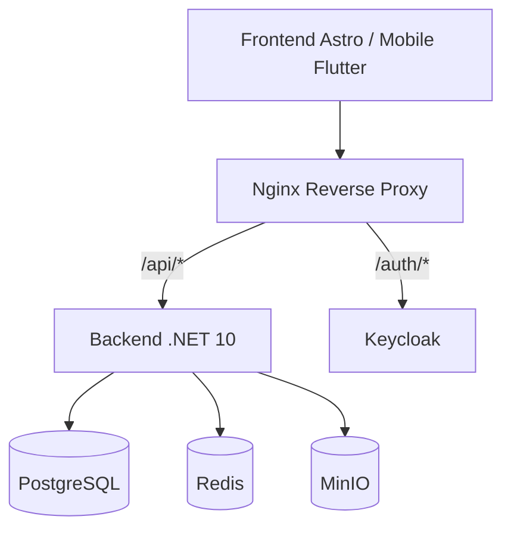
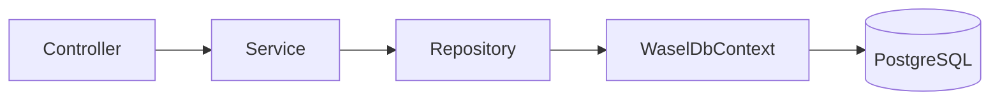
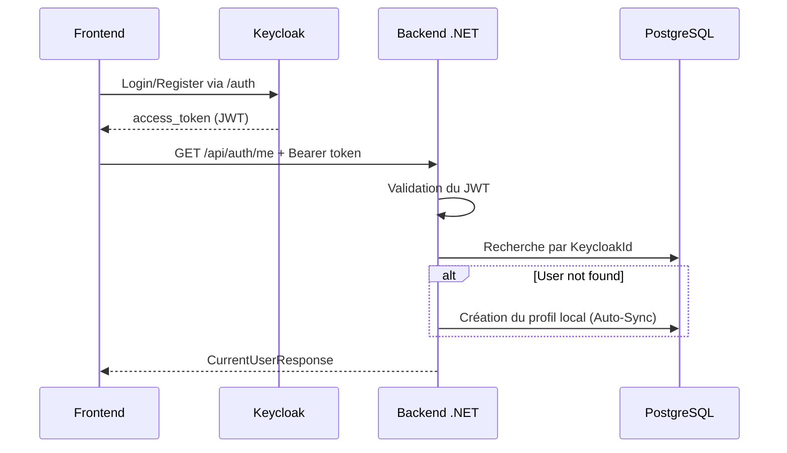
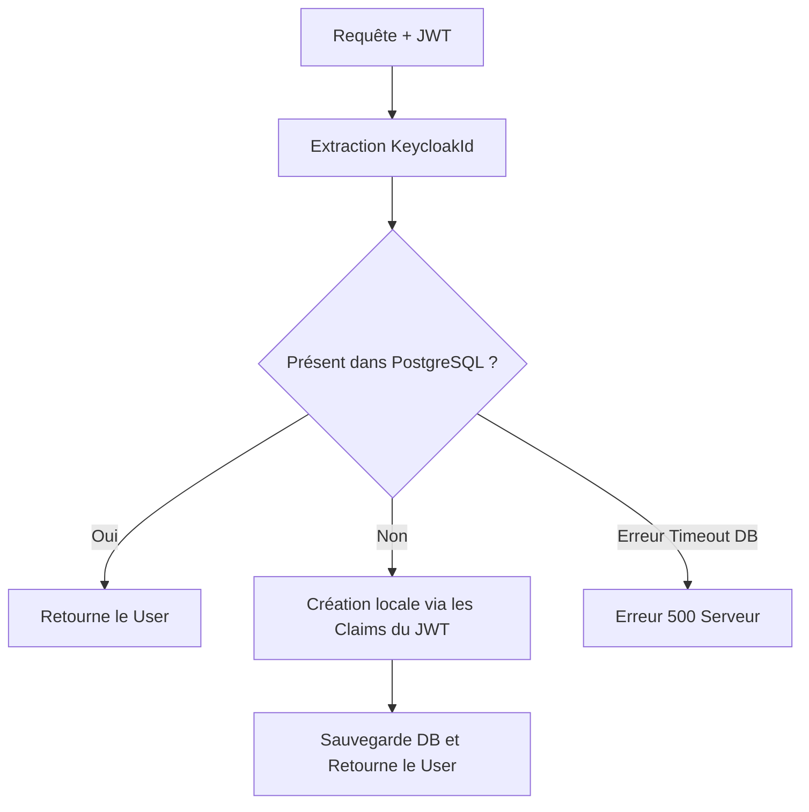
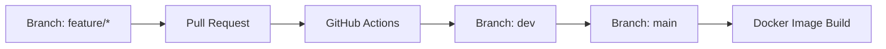

# Rapport Technique et Pédagogique : Architecture du Projet Wassel

## 1. Introduction générale du projet

**Qu'est-ce que Wassel ?**  
Wassel est une plateforme applicative moderne (livraison, transport et logistique). Le projet vise à connecter des utilisateurs (clients, chauffeurs, administrateurs) via une interface web et mobile. 

**Le rôle du backend**  
Le backend est le "cerveau" de l'application. Il ne gère pas l'affichage graphique, mais s'occupe de la logique métier, de la sécurité, des calculs, et de la sauvegarde des données. Il agit comme une API REST que les frontends (Astro et Flutter) vont interroger.

**Pourquoi une infrastructure locale ?**  
Avoir une infrastructure locale (Docker) permet à chaque développeur de l'équipe d'avoir exactement le même environnement que la production (même base de données, même système d'authentification) sur sa propre machine, sans dépendre d'Internet ni payer des serveurs cloud pendant le développement.

**Pourquoi un monolithe modulaire ?**  
Plutôt que de faire directement des microservices (ce qui est très complexe à maintenir et à déployer pour une petite équipe), le choix s'est porté sur un "monolithe modulaire". C'est un seul exécutable (.NET), mais à l'intérieur, le code est strictement séparé en "modules" indépendants (Auth, Users, Drivers...). Si l'application doit évoluer massivement, il sera très facile de séparer ces modules en véritables microservices.

**Les technologies choisies :**
*   **Docker** : Conteneurisation de l'environnement (`docker compose up`).
*   **Keycloak** : Gestion de la sécurité, de l'identité et des rôles (IAM).
*   **Nginx** : Reverse Proxy agissant comme chef d'orchestre pour le routage.
*   **PostgreSQL** : Base de données relationnelle robuste et fiable.
*   **Redis** : Base de données en mémoire pour le cache et le temps réel (Tracking).
*   **MinIO** : Stockage objet compatible S3 pour les fichiers (images, documents).

---

## 2. Architecture globale du système

L'architecture repose sur un Reverse Proxy central (Nginx) qui dispatche les requêtes HTTP soit vers le système d'authentification (Keycloak), soit vers la logique métier (Backend .NET).



*   **Frontend Astro / Mobile Flutter** : Interface utilisateur. Elle ne communique jamais directement avec la base de données.
*   **Nginx** : Intercepte toutes les requêtes.
*   **Backend .NET** : Applique les règles métier et s'interface avec les données.

---

## 3. Pourquoi Nginx ?

Nginx est notre **Reverse Proxy**. C'est le point d'entrée unique de notre application. 

**Pourquoi est-ce indispensable ?**
1.  **Simplicité pour le frontend** : Le frontend n'a besoin de connaître qu'une seule URL de base (ex: `http://localhost`).
2.  **Sécurité et CORS** : En servant l'API et Keycloak sur le même domaine, on évite les problèmes de Cross-Origin Resource Sharing.
3.  **Proche de la production** : En production, Nginx gérera les certificats HTTPS (SSL) et la répartition de charge.

**Les URLs de base :**
*   API via Nginx : `http://localhost/api`
*   Keycloak via Nginx : `http://localhost/auth`

---

## 4. Architecture backend .NET

Le backend est une API REST développée en **C# avec .NET 10**. Il est conçu en modules pour séparer les responsabilités selon les principes de la Clean Architecture simplifiée.



**Rôle des composants :**
*   **Controller** : Point d'entrée HTTP. Reçoit la requête et la délègue.
*   **Service** : Contient toute la logique métier et les règles de gestion.
*   **Repository** : Composant exclusif pour l'accès aux données.
*   **DTO (Data Transfer Object)** : Objets simples pour le transfert de données (masquage d'informations sensibles).
*   **Entity** : Représentation C# d'une table PostgreSQL.
*   **DbContext** : Composant Entity Framework Core traduisant le C# en SQL.

---

## 5. Structure des dossiers du projet

Le projet isole chaque fonctionnalité métier :

```text
backend/Wasel.Api/
  Modules/
    Auth/          # Authentification, auto-sync et profil utilisateur courant
    Users/         # CRUD utilisateurs (Administration)
    Drivers/       # Logique spécifique aux chauffeurs
    Deliveries/    # Gestion des courses et trajets
    Documents/     # Stockage des pièces d'identité et justificatifs
    Tracking/      # Positionnement géographique
    Payments/      # Transactions financières
    Reviews/       # Système d'évaluation
  Shared/
    Database/      # WasselDbContext centralisé
    Security/      # Résolution du contexte utilisateur courant
    Exceptions/    # Intercepteurs globaux d'erreurs
  Infrastructure/
    Keycloak/      # Configurations d'intégration IAM
```

---

## 6. Fonctionnement de l'authentification

Une décision architecturale forte : **Le backend ne gère pas les mots de passe.**

**Keycloak s'occupe de :**
*   Fournir les interfaces de Login / Register.
*   Sécuriser les mots de passe.
*   Délivrer les jetons de sécurité (JWT).

**Le Backend .NET s'occupe de :**
*   Valider cryptographiquement le JWT.
*   Lier l'identité externe à un profil métier local.
*   Appliquer les autorisations complexes.

> [!IMPORTANT]
> Il n'y a **aucun** endpoint `/api/auth/login` ni `/api/auth/register` dans le backend.



---

## 7. Auto-sync backend avec `EnsureCurrentUserExistsAsync()`

Pour éviter que le frontend n'ait à gérer manuellement la création de l'utilisateur en base de données après un login réussi (ce qui serait vulnérable aux coupures réseau), une synchronisation automatique est en place.



Si l'utilisateur n'est pas trouvé (règle métier), le profil est créé. S'il y a un défaut de connexion base de données (erreur technique), l'opération est annulée pour prévenir la corruption de données.

---

## 8. Endpoints disponibles

### Accessibilité Publique
*   `GET /api/health` : Statut de l'infrastructure.

### Authentification (Connecté)
*   `GET /api/auth/me` : Point d'entrée principal. Récupère le profil et déclenche l'auto-sync.
*   `PATCH /api/auth/me/profile` : Mise à jour de ses informations personnelles.
*   `POST /api/auth/sync` : Synchronisation forcée (Mode Debug).
*   `GET /api/auth/claims` : Outil développeur pour inspecter le JWT.

### Administration (Rôle: Admin)
*   `GET /api/admin/users` : Liste complète.
*   `GET /api/admin/users/{id}` : Fiche détaillée.
*   `PATCH /api/admin/users/{id}/status` : Suspension ou activation de compte.

---

## 9. Comment le frontend doit travailler

L'intégration OIDC pour l'équipe Frontend est standardisée :

1.  Redirection vers `/auth` (Keycloak).
2.  Récupération de l'`access_token`.
3.  Appel de `GET /api/auth/me` pour s'assurer que le profil backend est initialisé.
4.  Transmission du Token dans le header `Authorization: Bearer <token>` pour tous les appels métier subséquents.

---

## 10. Comment ajouter un nouveau module backend (Ex: Drivers)

L'ajout d'une fonctionnalité suit un flux précis et déterministe :

1.  **Entity** : Création de la classe `Driver`.
2.  **DbContext** : Ajout du `DbSet<Driver>`.
3.  **DTOs** : Définition des payloads d'entrée/sortie.
4.  **Repository** : Logique d'accès DB (`IDriverRepository`).
5.  **Service** : Logique métier (`IDriverService`).
6.  **Controller** : Exposition HTTP (`DriversController`).
7.  **Configuration** : Injection de dépendances dans `Program.cs`.
8.  **Base de données** : Génération de la migration EF Core.

---

## 11. Rôle des solutions de stockage

*   **PostgreSQL** : Vérité absolue du système. Données relationnelles complexes et consistantes (ACID).
*   **Redis** : Optimisation des performances. Cache rapide et données éphémères (Tracking GPS).
*   **MinIO** : Offloading des fichiers lourds. Évite la saturation de la base de données relationnelle.

---

## 12. CI/CD et cycle de développement

Le projet suit une approche GitFlow simplifiée et de l'intégration continue :



---

## 13. FAQ pour Soutenance et Défense du Projet

**Q: Pourquoi avez-vous choisi Keycloak ?**  
*R: La gestion de la cryptographie, de la sécurité des identifiants et des flux OAuth2 est critique et propice aux failles. Déléguer cette responsabilité à Keycloak permet de sécuriser le système selon les standards industriels et d'accélérer le développement métier.*

**Q: Pourquoi n'y a-t-il pas de route de login sur le backend ?**  
*R: Pour respecter l'isolation des responsabilités de la norme OIDC. Notre backend ne doit jamais voir ni manipuler un mot de passe en clair. Il se base exclusivement sur des jetons signés.*

**Q: À quoi sert réellement l'auto-sync ?**  
*R: Elle garantit l'intégrité de nos données. Si le frontend devait gérer la création via deux appels distincts, une coupure réseau pourrait créer un "compte fantôme" dans Keycloak sans son équivalent PostgreSQL. Le backend agit ici comme un garde-fou transactionnel.*

**Q: Pourquoi un monolithe modulaire ?**  
*R: Démarrer directement en microservices entraîne une surcharge infrastructurelle (latence, orchestration, transactions distribuées) disproportionnée pour le moment. Le monolithe modulaire permet un déploiement simple tout en imposant une rigueur architecturale prête à être divisée le jour où le trafic l'exigera.*

---

## 14. Bilan du projet

### Réalisé
*   Architecture complète validée.
*   Environnement Docker Compose local avec Nginx fonctionnel.
*   Intégration Keycloak et stratégie OIDC complétée.
*   Middleware de synchronisation automatique opérationnel.
*   Endpoints d'authentification et d'administration terminés.
*   Tests automatisés (E2E Auth) validés à 100%.

### À faire
*   Implémentation des cœurs métiers (Drivers, Deliveries).
*   Test unitaires xUnit.
*   Intégration définitive avec Astro (Web) et Flutter (Mobile).
*   Préparation du déploiement (HTTPS, gestion des secrets, monitoring).

---

## 🎙️ Pitch de présentation (2 minutes)

> "Bonjour. Je suis responsable de l'infrastructure et de l'architecture backend du projet Wassel.
> 
> Wassel repose sur une architecture de type **Monolithe Modulaire** en **.NET 10**. Nous avons fait ce choix car il offre la simplicité de déploiement d'une seule application, tout en garantissant un code strictement isolé par domaines métier, prêt à évoluer vers des microservices si nécessaire.
>
> Pour garantir la portabilité et la robustesse, tout l'environnement est conteneurisé avec **Docker** derrière un proxy **Nginx**. Ce proxy est notre point d'entrée unique : il redirige le trafic soit vers notre logique métier, soit vers notre serveur de gestion des identités, **Keycloak**.
> 
> Une décision technique clé a été de **ne jamais stocker les mots de passe** dans notre base PostgreSQL. Toute l'authentification est déléguée à Keycloak. Le frontend récupère un Token JWT, et l'envoie à notre API. 
> 
> Pour relier cette identité externe à notre domaine métier, j'ai implémenté un système **d'auto-synchronisation intelligente** côté serveur : à la première requête d'un utilisateur authentifié, le backend intercepte le Token et crée son profil dans PostgreSQL à la volée. C'est sécurisé et 100% transparent pour le client.
> 
> Aujourd'hui, notre socle technique est solide, testé et prêt à accueillir le développement accéléré de nos modules de livraison."
