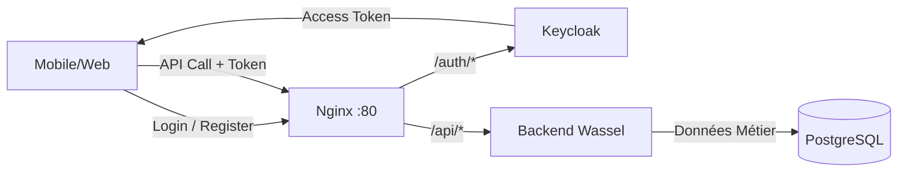

# Guide Frontend — Authentification Wassel avec Keycloak

Ce document est la référence pour les équipes frontend (Flutter et Astro) concernant l'intégration de l'authentification avec Keycloak et l'API backend Wassel.

---

## 1. Vue globale

Dans l'architecture Wassel, la gestion des identités est séparée de la logique métier :

- **Keycloak gère l'identité :**
  - Inscription (Registration)
  - Connexion (Login)
  - Stockage sécurisé des mots de passe
  - Gestion des rôles (`ADMIN`, `CLIENT`, `DRIVER`)
  - Émission des tokens (JWT)
  - Plus tard : réinitialisation de mot de passe (Reset password), vérification d'email.
- **Backend Wassel gère la logique métier :**
  - Validation du JWT généré par Keycloak
  - Stockage du profil métier local
  - Statut des utilisateurs (actif, en attente, bloqué)
  - Données liées aux livraisons, livreurs, documents, etc.



---

## 2. Ce que Keycloak contient

Keycloak est la source de vérité pour l'identité de l'utilisateur. Il contient :
- `username` (identifiant unique, souvent l'email)
- `email`
- Mot de passe (haché et sécurisé)
- `email verified` (statut de vérification)
- Prénom et nom (s'ils sont configurés lors de l'inscription)
- Rôles : `ADMIN`, `CLIENT`, ou `DRIVER`
- Sessions actives
- Tokens émis

> [!IMPORTANT]
> **Le mot de passe n'est jamais stocké dans PostgreSQL ni dans le backend Wassel.** Il est géré exclusivement par Keycloak.

---

## 3. Ce que PostgreSQL contient

Le backend Wassel (via PostgreSQL) stocke le profil métier et les relations de l'utilisateur avec le reste de la plateforme.

Champs métier actuels de l'entité `User` :
- `Id` (Identifiant interne Wassel)
- `KeycloakId` (Le lien unique vers l'identité Keycloak)
- `Cin` (Carte d'identité nationale)
- `FirstName` (Prénom)
- `LastName` (Nom)
- `Email` (Copié de Keycloak pour faciliter les recherches internes)
- `Phone` (Numéro de téléphone)
- `Status` (Statut d'approbation : Pending, Active, Inactive, Blocked)
- `ProfileObjectKey` (Lien vers l'image de profil dans MinIO)
- `CreatedAt`
- `UpdatedAt`

---

## 4. Endpoints backend disponibles

La plupart des routes métier et toutes les routes protégées requièrent un token JWT valide émis par Keycloak. Certaines routes techniques, comme `/api/health`, restent publiques.

| Endpoint | Méthode | Protection | Utilité frontend |
|---|---|---|---|
| `/api/auth/me` | GET | Token requis | Récupérer l'utilisateur Wassel connecté **(auto-crée le profil local si absent)** |
| `/api/auth/sync` | POST | Token requis | ~~Obligatoire~~ **Optionnel** — compatibilité uniquement. L'auto-sync est fait par `/api/auth/me` |
| `/api/auth/me/profile` | PATCH | Token requis | Compléter/modifier le profil local (ex: ajout CIN, téléphone). **(auto-crée le profil local si absent)** |
| `/api/auth/claims` | GET | Token requis (Dev Only) | Déboguer les claims contenus dans le token |
| `/api/admin/users` | GET | Rôle ADMIN | Liste de tous les utilisateurs (Dashboard Web) |
| `/api/admin/users/{id}` | GET | Rôle ADMIN | Détail d'un utilisateur spécifique |
| `/api/admin/users/{id}/status` | PATCH | Rôle ADMIN | Changer le statut d'un utilisateur |

> [!WARNING]
> Il n'y a **pas** d'endpoints de login ou d'inscription sur l'API Wassel. Ces actions se font directement via Keycloak (OIDC).

---

## 5. Cycle de vie complet côté utilisateur

Voici le flux exact que le frontend doit implémenter :

### 5.1 Première ouverture de l'application
- L'utilisateur n'a pas encore de token local.
- Afficher les boutons "Se connecter" / "Créer un compte".

### 5.2 Inscription
- L'inscription identité se fait via Keycloak.
- Le frontend doit utiliser un flux OIDC (OpenID Connect).
- *Pour la V1/Dev :* Des utilisateurs de test existent déjà (grâce à `realm-export.json`).
- *Pour la Production :* Pour la production, l'option recommandée est d'utiliser le flow d'inscription Keycloak via OIDC, avec self-registration activé si nécessaire. L'utilisation directe de l'API Admin Keycloak pour créer des utilisateurs depuis le frontend n'est pas recommandée.

### 5.3 Connexion
- L'utilisateur se connecte via la page de login Keycloak.
- Keycloak retourne un `access_token` (et potentiellement un `refresh_token`).
- Le frontend stocke ce token de façon sécurisée (Secure Storage / HttpOnly Cookie).

### 5.4 Récupérer le profil connecté (auto-sync)
Pour afficher les informations de l'utilisateur dans l'application, appelez :
```http
GET /api/auth/me
Authorization: Bearer <access_token>
```

> [!TIP]
> **Auto-sync** : Cet endpoint crée automatiquement le profil local dans PostgreSQL si l'utilisateur n'existe pas encore. Il n'est plus nécessaire d'appeler `POST /api/auth/sync` avant. L'endpoint `/api/auth/sync` reste disponible pour la compatibilité, mais n'est plus obligatoire.

### 5.5 Compléter le profil
Si des informations sont manquantes (ex: téléphone, CIN), proposez un formulaire puis appelez :
```http
PATCH /api/auth/me/profile
Authorization: Bearer <access_token>
Content-Type: application/json

{
  "cin": "AB123456",
  "phone": "0600000000",
  "firstName": "Yassine",
  "lastName": "Amrani",
  "profileObjectKey": null
}
```

> [!NOTE]
> Cet endpoint auto-crée le profil local si absent. Pas besoin de vérifier si l'utilisateur a été synchronisé avant.

### 5.6 Utiliser les APIs protégées
Toutes les requêtes suivantes vers le backend Wassel devront inclure l'en-tête HTTP :
`Authorization: Bearer <access_token>`

### 5.7 Déconnexion
- Supprimer les tokens (access et refresh) côté stockage local du frontend.
- *Plus tard :* Appeler l'endpoint de logout de Keycloak pour invalider la session côté serveur.
- *Note :* Il n'existe pas d'endpoint `/api/auth/logout` côté backend Wassel, le backend est "stateless".

---

## 6. Cycle spécifique Admin Web

L'administrateur utilise le portail Web (Astro).
1. Login via Keycloak avec un compte ayant le rôle `ADMIN`.
2. Appel à `GET /api/auth/me` pour afficher son nom **(le profil local est auto-créé)**.
3. Appel à `GET /api/admin/users` pour afficher la liste des clients/livreurs.
4. Pour valider ou bloquer un compte, appel à `PATCH /api/admin/users/{id}/status` avec :
```json
{
  "status": "Active"
}
```
*Statuts disponibles : `Pending`, `Active`, `Inactive`, `Blocked`.*

---

## 7. Cycle spécifique Client Mobile

L'application Mobile (Flutter) pour les clients :
1. Login/Register via le flux OIDC Keycloak (Le rôle `CLIENT` est attribué par défaut ou via la configuration Keycloak).
2. Appel `GET /api/auth/me` pour récupérer ses données **(le profil local est auto-créé)**.
3. Si le profil est incomplet, proposer de remplir et appeler `PATCH /api/auth/me/profile`.
4. *Plus tard :* Création de livraisons.

---

## 8. Cycle spécifique Driver Mobile

L'application Mobile (Flutter) pour les livreurs :
1. Login/Register via Keycloak (avec le rôle `DRIVER`).
2. Appel `GET /api/auth/me` **(le profil local est auto-créé)**.
3. Complétion obligatoire des données via `PATCH /api/auth/me/profile`.
4. *Plus tard :* Dépôt du dossier livreur (module Driver/Documents) qui changera son statut métier local (ex: de Pending à Active par l'admin).

---

## 9. Intégration Flutter

**Approche Recommandée : Authorization Code Flow + PKCE**

Pour une intégration mobile sécurisée et standard :
- Utilisez une bibliothèque compatible OAuth/OIDC comme `flutter_appauth`.
- **Ne créez pas de formulaire de login "maison" (avec champs email/password).**
- **N'utilisez pas de WebView interne classique** pour capturer les identifiants.
- Utilisez le navigateur système via des mécanismes sécurisés (Custom Tabs sur Android, ASWebAuthenticationSession sur iOS).

**Pseudo-code Flutter :**
```dart
// 1. Démarrer le flux de login via le navigateur système
final authResult = await appAuth.authorizeAndExchangeCode(
  AuthorizationTokenRequest(
    clientId,
    redirectUrl,
    issuer: keycloakIssuerUrl,
    scopes: ['openid', 'profile', 'email'],
  ),
);

// 2. Récupérer l'accessToken
final accessToken = authResult.accessToken;

// 3. Sauvegarder le token de manière sécurisée (ex: flutter_secure_storage)
await secureStorage.write(key: 'access_token', value: accessToken);

// 4. Récupérer le profil (auto-sync : le profil local est créé automatiquement)
final userProfile = await api.get('/api/auth/me', headers: {'Authorization': 'Bearer $accessToken'});
// Note : POST /api/auth/sync n'est plus nécessaire, GET /api/auth/me fait l'auto-sync
```

---

## 10. Intégration Astro/Web

Deux options sont possibles pour le Web Admin :

### Option V1 simple (Recommandée pour l'instant)
- Utiliser un client OIDC côté navigateur (ex: `oidc-client-ts` ou similaire).
- Redirection de l'utilisateur vers la page de login Keycloak.
- Récupération du token côté client après la redirection.
- Appels API vers Wassel en ajoutant le header `Authorization: Bearer <token>`.

### Option plus professionnelle (Plus tard)
- Utilisation du pattern **BFF** (Backend For Frontend).
- Le serveur Astro (Node.js) gère la communication avec Keycloak et la détention des tokens.
- Le navigateur de l'utilisateur reçoit uniquement un cookie HTTP-Only sécurisé et crypté.
- L'API Wassel est appelée par le serveur Astro.

---

## 11. Tests locaux avec cURL

Pour les tests de développement backend, vous pouvez utiliser le flux direct (Resource Owner Password Credentials Grant). 

> [!WARNING]
> **Ne pas utiliser `grant_type=password` dans le code Flutter ou Astro final. Cette méthode est réservée aux tests locaux uniquement.**

**1. Récupérer un token de test :**
```bash
# Via accès direct Keycloak
curl --location --request POST 'http://localhost:8080/auth/realms/wasel/protocol/openid-connect/token' \
--header 'Content-Type: application/x-www-form-urlencoded' \
--data-urlencode 'client_id=wasel-api' \
--data-urlencode 'username=admin@wasel.ma' \
--data-urlencode 'password=admin123' \
--data-urlencode 'grant_type=password'

# Ou via Nginx
curl --location --request POST 'http://localhost/auth/realms/wasel/protocol/openid-connect/token' \
--header 'Content-Type: application/x-www-form-urlencoded' \
--data-urlencode 'client_id=wasel-api' \
--data-urlencode 'username=admin@wasel.ma' \
--data-urlencode 'password=admin123' \
--data-urlencode 'grant_type=password'
```

**2. Utiliser l'API avec le token :**
```bash
TOKEN="ey..." # Remplacer par l'access_token récupéré

# Via accès direct
curl -X GET http://localhost:5000/api/auth/me -H "Authorization: Bearer $TOKEN"

# Via Nginx (recommandé)
curl -X GET http://localhost/api/auth/me -H "Authorization: Bearer $TOKEN"
curl -X GET http://localhost/api/admin/users -H "Authorization: Bearer $TOKEN"
```

---

## 12. Réponses HTTP à gérer côté frontend

Le frontend doit anticiper ces différents codes de retour de l'API Wassel :

| Code HTTP | Signification | Action frontend attendue |
|---|---|---|
| **200** | OK | Afficher les données. |
| **400** | Données invalides | Afficher un message d'erreur de validation (ex: CIN mal formaté). |
| **401** | Token absent, invalide ou expiré | Supprimer le token local, rediriger vers l'écran de login. |
| **403** | Rôle insuffisant | Afficher une page "Accès refusé" (ex: un Client tente d'accéder à `/api/admin`). |
| **404** | Ressource non trouvée | Ressource métier introuvable (pas un problème de sync — le profil local est auto-créé). |
| **500** | Erreur serveur | Afficher un message générique (ex: "Une erreur inattendue est survenue"). |

---

## 13. Questions fréquentes

### Est-ce que le backend Wassel fait le login ?
**Non**, Keycloak gère l'authentification et la vérification des mots de passe.

### Est-ce que le backend Wassel fait l'inscription ?
**Non**, la création de l'identité sécurisée se fait via Keycloak. Wassel crée automatiquement la copie du profil métier local lors du premier appel à `GET /api/auth/me` ou `PATCH /api/auth/me/profile` (auto-sync).

### Est-ce que le frontend doit utiliser l'Admin Console Keycloak ?
**Non**. L'Admin Console Keycloak (sur le port 8080) est réservée aux développeurs et aux administrateurs système. Les utilisateurs de l'app mobile ou du panel Admin Web Wassel doivent passer par le flux OIDC classique.

### Est-ce qu'on peut changer l'email avec `/api/auth/me/profile` ?
**Non**, pas actuellement. L'email est une donnée d'identité. Il doit être modifié côté Keycloak (flux spécifique), et Wassel le mettra à jour au prochain appel de `/api/auth/sync`.

### Est-ce qu'on peut changer le mot de passe avec l'API Wassel ?
**Non**, Wassel ne connaît pas et ne gère pas les mots de passe. C'est une fonctionnalité que fournira Keycloak.

### Est-ce que `/api/auth/claims` doit être utilisé par le frontend ?
**Non**, c'est un endpoint de débogage activé uniquement en environnement de développement pour aider les développeurs à voir le contenu de leur token.

---

## 14. Ce qui est déjà possible aujourd'hui (V1)

- Se connecter via Keycloak avec les utilisateurs de test pré-configurés (`admin@wasel.ma`, `client@wasel.ma`).
- Récupérer des tokens JWT valides.
- Synchroniser le profil local (`/api/auth/sync`).
- Récupérer l'utilisateur connecté (`/api/auth/me`).
- Mettre à jour des informations de profil métier (`/api/auth/me/profile`).
- Accéder à la liste des utilisateurs si l'on possède le rôle `ADMIN` (`/api/admin/users`).
- Refus d'accès automatique aux routes Admin si l'on possède un rôle `CLIENT`.

---

## 15. Ce qui reste à faire plus tard

- Intégration réelle dans l'application Flutter avec PKCE.
- Intégration réelle dans le portail Astro avec un client OIDC.
- Activation et configuration propre du Self-registration (inscription publique) sur Keycloak.
- Flux de "Mot de passe oublié" (Forgot password) via Keycloak.
- Flux de "Changement de mot de passe" via Keycloak.
- Flux de "Changement d'email" via Keycloak.
- Implémentation du refresh token côté Mobile/Web pour éviter les déconnexions fréquentes.
- Appel du endpoint Logout de Keycloak pour fermer la session globale.
- Développement des modules métiers : Livraisons, Documents (MinIO), Tracking.

---

## 16. Checklist Frontend

Pour valider l'intégration auth sur chaque client (Flutter / Astro), assurez-vous de pouvoir cocher ces cases :

- [ ] La connexion redirige bien vers Keycloak (via OIDC).
- [ ] L'Access Token est correctement récupéré après la redirection.
- [ ] Le Token est stocké de manière sécurisée sur l'appareil.
- [ ] Le header `Authorization: Bearer <token>` est ajouté à toutes les requêtes vers l'API Wassel.
- [ ] L'appel `GET /api/auth/me` permet d'afficher les informations utilisateur **(le profil local est auto-créé)**.
- [ ] Le `localUserId` retourné par `/api/auth/me` est non-null (preuve de l'auto-sync).
- [ ] Le formulaire de modification de profil appelle bien `PATCH /api/auth/me/profile` avec les bonnes données.
- [ ] Une erreur `401 Unauthorized` de l'API déclenche une déconnexion automatique ou un refresh token.
- [ ] Une erreur `403 Forbidden` est gérée gracieusement.
- [ ] La déconnexion locale supprime bien les tokens stockés.
